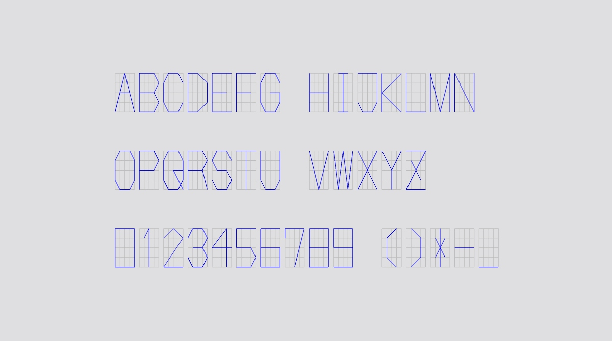

# Matrix_Font  

5x5 のマトリクス上で形を定義して、最小限で文字を書く。  
とりあえず英字の大文字と、数字、多少の記号を作った。  

  

- レーザー加工時、効率よい。  
- フォントの世話をしなくても良い（テキストオブジェクトとして保持させた方が良いときもあるので時と場合による）。  
- ある程度統一感のあるフォントだと、表に出ない施工支援だとして綺麗なので良い。  

建築実務においてジオメトリエンジニアとして施工まで担っていた人のプロジェクトファイルを見たときにこんな感じシリアライズがされていて組立てが簡単だった。  
それ以後、毎回文字のカーブを取り込んだりしてやっていましたが、作業がだるい + あまり綺麗じゃないので、ちゃんと作った。  

また、他ソフトや　いろんな取り回しが出来るように、マトリクス上で定義し、汎用のデータシートに入れ、それを読むという方式を目指した。  

データシート例↓  

| Charactor | Matrix |
| ---- | ---- |
| "A" | [ [0,0], [2,4], [4,0], [3,2], [1,2] ] |
| "B" | [ [0,0], [0,4], [3,4], [4,3], [3,2], [0,2], [3,2], [4,1], [3,0], [0,0] ] |
| "C" | [ [4,3], [3,4], [1,4], [0,3], [0,1], [1,0], [3,0], [4,1] ] |
| "D" | [ [0,4], [0,0], [2,0], [4,1], [4,3], [2,4], [0,4] ] |
| "E" | [ [4,4], [0,4], [0,2], [3,2], [0,2], [0,0], [4,0] ] |
| "F" | [ [4,4], [0,4], [0,2], [3,2], [0,2], [0,0] ] |
| ... | ... |  

---  

### フォントの使い方  

都度都度、用途に合わせて、csv （or json）のデータシートから読み出し、スケール等を調整して使う。  

csv は、[u, v] の形の、 "," のところで区切りとしてとられるので汚い。  
行を区切りとし、スクリプト側で対応。json にした方が良いかも。  

Rhino + gh だけの都合で言えば、コンポーネント内にフォントの定義があったほうが取り回しが楽なので、辞書型にしてスクリプトの中に入れる。  
.ghuser ファイルにしておいてもいい。

---  

### フォントを追加する

Rhino 上で書いて、gh 上で、マトリクスに読み替え、csv (or json?) のデータシートに書き入れる。  

csv から、辞書型に変換してスクリプトに追加する。

---  

